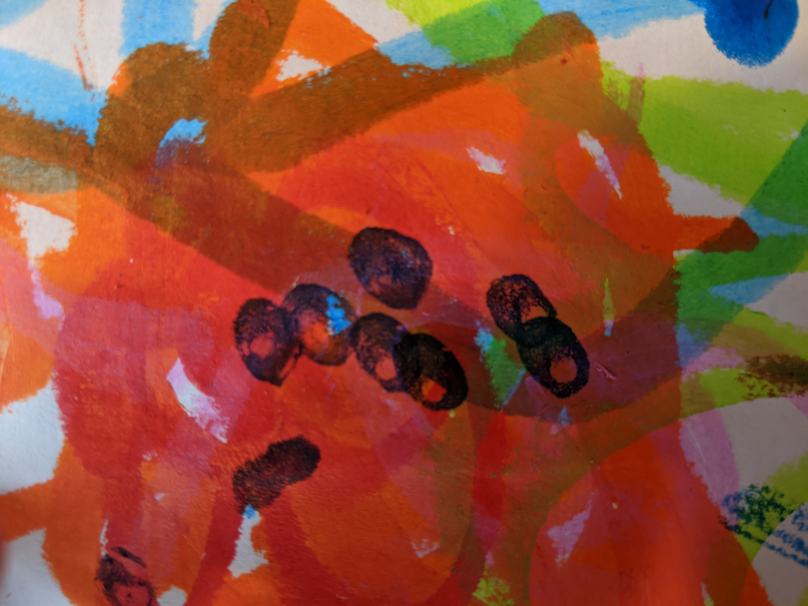
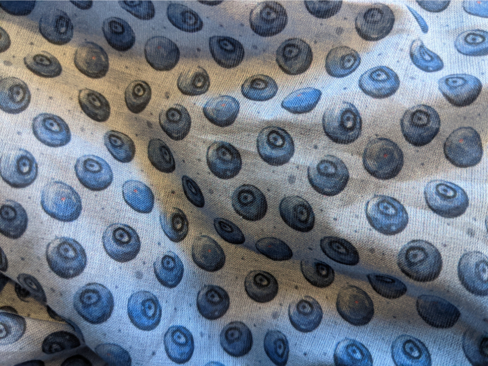

## Looking for inspiration

In summer 2020 our kid started painting with fat, waterbased crayons. While initially expressing himself hammering colour on a page, he nevertheless is a great source of inspiration. One of his first drawings proved to be the base for a pattern I ended up having printed on fabric. 

Be warned, that I could not reach his level of expression in the final result. 

The little blue dots you can see in the center of the page were looking similar to blueberries. In front of my inner eye I could see a berry pattern, that would give the impression of polka dots from further away. 

## Process

Normally going for vector patterns I tried different approaches. The final pattern was drawn and redrawn again in [Krita](www.krita.org) using the endless pattern mode (sadly affinity has yet to provide something similar, preferrably for vector patterns too). 

As Krita kept messing up the layers and berries at the corner of the pattern, the whole thing had to be redrawn again and again. Together with printouts getting the colours right did pose the next challenge, as I had no clue, what the final print on a very light fabric would look like. 

## Results

After ordering everything, waiting took more than a month, until the fabric was delivered to our doorstep. The result is a little weaker in contrast than I hoped but overall, I'm very happy with the outcome. 

