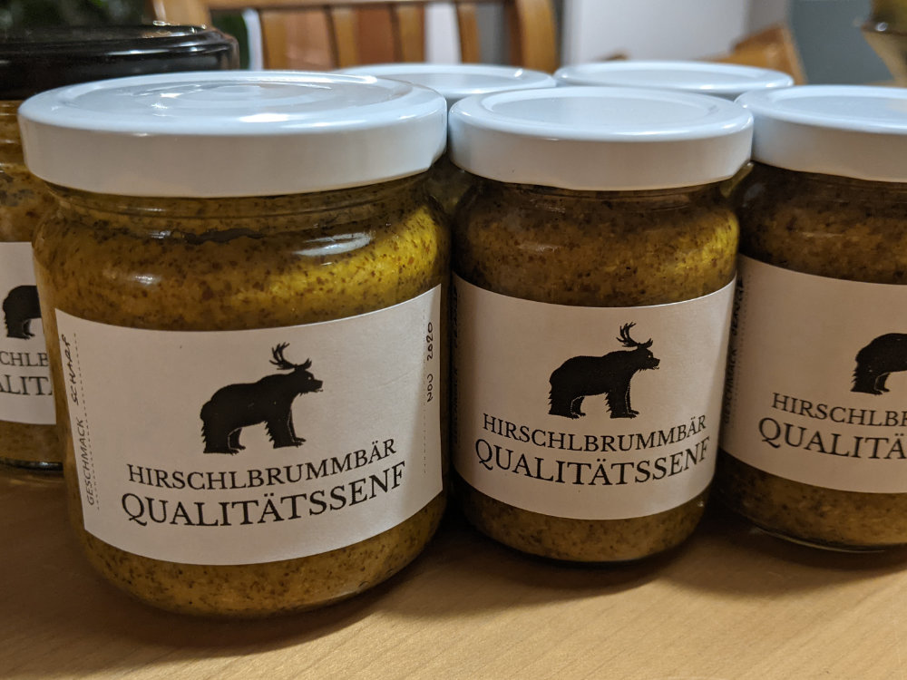

## You can feel it in the nose

Have you ever tought about making bread, gave up because you didn't find the time and then suddendly the pandemic gave you a lot of opportunities to express yourself dough-wise? Apparently similar things have happened to lots of people around the world. 

Fortunately I'm lucky to have someone who can make better bread than me. Other products like hot sauces have been taken care of by my brother in law (and we still have our own habanero-oil that might now be considered "aged").

Not that I was searching, but when I noticed that you can make your own mustard (apparently I was not the only one thinking that it's a tricky process), I was ready to go. 

Getting the ingredients was easy and really making the mustard too. The first batch was made with 50% black 50% yellow mustard seeds. It was easily possible to make an orange-flavoured version in addition to the "normal" version. The hard part was giving the product a name and creating a label that would convey it's superior quality...

After a creative process spanning multiple weeks, in the end the brand Hirschlbrummbär was born. In hommage to the german mustardmaker "händlmaier" and my own name.

Next time, I'll go with a lighter version or try a whisky or beer-mustard.

Drop me a line, if you want the recipe or try it yourself, there are plenty of pages in the internet.

PS: in case you were wondering: this is also, where the "stag-bear" in the upper left is coming from.

## Update 2023-03-30
I've been playing around with the recipe and learnt some things: 
- Not all vinegar has the same acidity. My initial batch was very strong - using apple vinegar is recommendet for a less sour experience.
- Better cutters make it easier to cut/grind the mustard seeds. Also steeping the seeds in vinegar/wine/water... Using both leads to a mustard similar to the paste you can buy in a supermarket (something with less seeds). 
- The internet never disappoints when looking for more inspiration. A lot of info about mustard can be found on [mustardmaker](https://mustardmaker.com/). The following recipe is adapted from the page: 

### Recipe for a Dijon style mustard
Add the following into a mixing glass: 
- 160g mustardseeds (I used golden and black seeds 50%/50%)
- 2dl water
- 1.5dl vinegar (white wine vinegar)
- 2.4 teaspoons kitchen salt (do not use seasalt)
- 2 teaspoons of Kurkuma

Let it steep for 2+ hours. Afterwards grind it in the kitchen-machine of your choice (we use a Kenwood Chef). Close it with a cloth and let it steep during 24 hours. Fill in small glasses and let it ripen in the fridge for 1 month - afterwards it's ready for consumption. 

I don't know how long it keeps. So far there has never been a spoilt glass of mustard - however it can lose all taste.  

