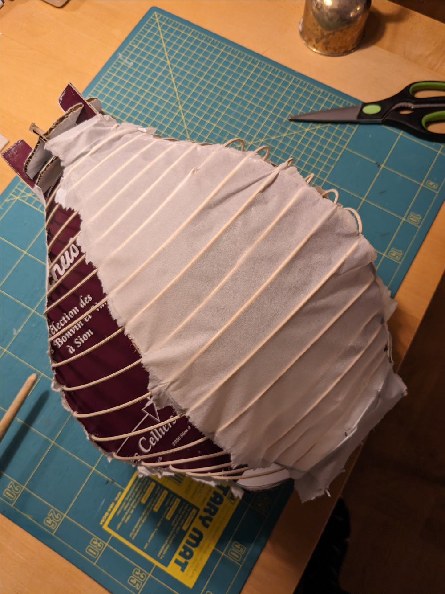
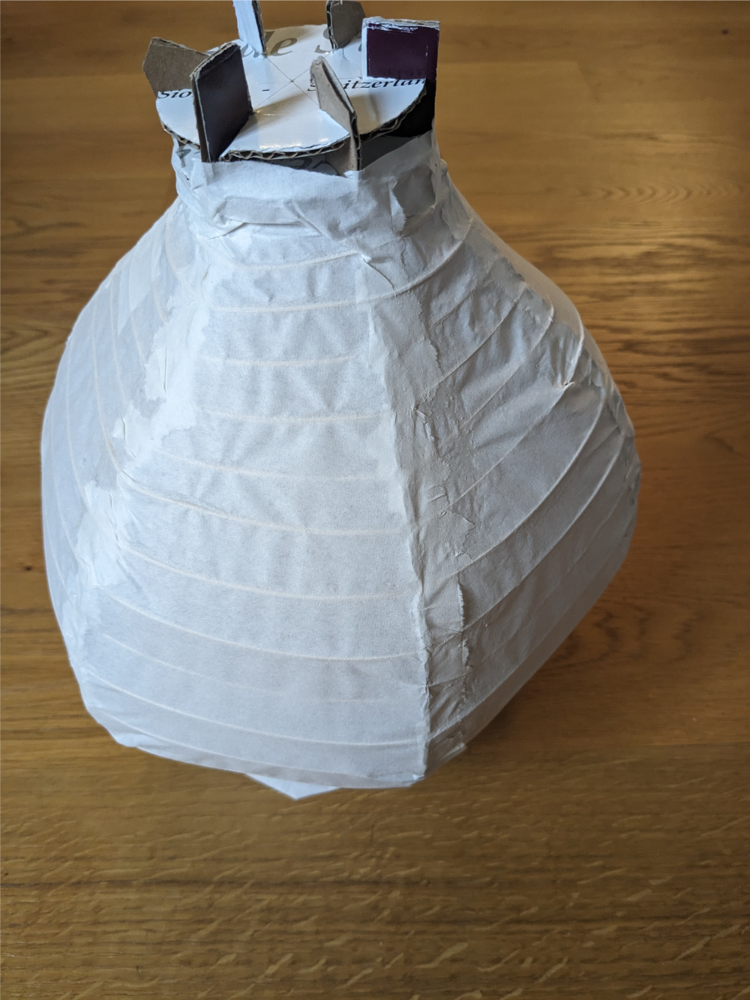
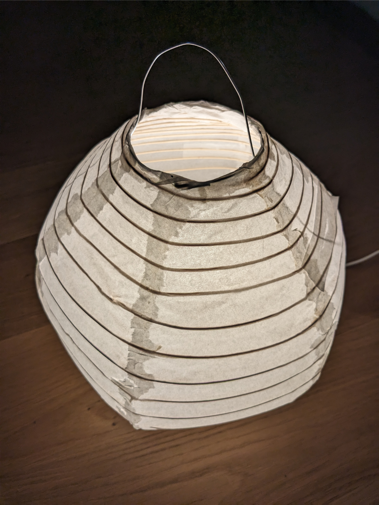

## Akari
If you've ever been in Japan, you might have noticed thousands of paper lanterns in entrances to little shops, sushi places, ramen restaurants and also in the street during festivals. Paper lanterns have a tradition of over 300 years. In different places, different lamps are assembled. Gifu paper lamps are famous, producers are in business for a very long time. The lamps give off a nice warm light, with the paper screen working very well as a diffusor. 

The trade of lamp making has been in the spotlight in the west, ever since Isao Noguchi reused the process to create his Akari light sculptures. Reusing old forms, but also introducing different shapes, his goal was to bring a piece of his design in every household in the world. 

The lamps have ever since been ubiquitous, IKEA has built their own lines (we have at least three different types from different series at home) and similar lights are ever since in all lamp shops you can think of visiting. Since the lamps change, it's hard to get a different similar one to one already in existence. And paper lamps are prone to breakage, with and without kids helping in the process. 

This entry describes an attempt to copy an existing paper lamp and gives an introduction in how they are most probably built. Assumption: most of them are still built by hand, despite the differences in price. There is a huge difference in quality in paper lamps, but even the cheapest ones sold are most probably better in most regard than the outcome of this experiment. 

## On building a lamp
Building a lamp takes some time. I read somewhere, that building an Akari lamp takes a skilled worker around six hours. Most of the necessary steps can be seen in [this video by vitra on youtube](https://www.youtube.com/watch?v=hQ8SbDJ7Cck). There is a lot more to the process, additional videos on youtube can give you hints about things I might have missed. 

Broadly, the follwing steps are ncessary. A base for the lamp has to be built. The base is a frame defining the shape of the lamp. A skeleton made out of bamboo, rattan, wire or something similar is draped over the shape. The skeleton can be a spring like structure or a series of rings. Depending on the design, the structure is reinforced using string (especially for hanging lamps to reduce tension on the paper). Paper is glued to the frame using rice starch glue called Sokui. A light source and depending on use case additional things (like feet, hanger, paintings, lacquer...) are added to finalize the lamp. 

More detail on the different steps in the following chapters.

### Base
The base defines the final shape of the lamp. It consists of two discs holding up multiple "ribs". The more ribs in the base, the more even designed the shape of the lamp. Lamps with less ribs tend to be more random in outcome and less uniform in shape (if this is desired). Based on the videos, the base is built from wood in professional lamp making shops. Wood is sturdy enough and since the base can be reused, it is well worth the investment if planning to make more than one lamp. The ribs can't be wider than the diameter of at least one of the discs, the discs themselves define the top / bottom openings of the lamp. 

In the project, the base was built from cardboard. For size I tried to match the shape of the existing lamp, but also fit the . Issues with calculations (cough, cough) led to the a slightly bigger lamp than intended (something I'll correct in a followup). I went for a six ribs setup. The bottom was made to fit a given lamp base (in my case the base of an old IKEA lamp).

Note, that since cardboard is not as sturdy as wood, there was some folding of the base under tension leading to some little distortion in the final lamp. 

### Skeleton
Normally bamboo is used - but how to slice bamboo? Store bought lamps sometimes also use wire. 
For this lamp I bought thin rattan (each around 1.5-2 meters long). Rattan has to be soaked before using, else it starts to break easily. The natural tension or shape of the rattan is big enough to give a stable lamp (I was initially afraid, it would just fold after removing the base). For attachment to the lamp a piece of wire has been added (on top and bottom). 

Where necessary, two pieces of rattan have to be pieced together. Unfortunately, the Sokui was disolving the paper initially bought - therefore I switched to using super glue for the joints. Different videos use string to wrap around the different parts. Also for a high-quality outcome, one of the sources shows flattening both sides before glueing. Obviously, this depends on the material used for the skeleton (i.e. the profile or cross-section).

### Paper
The paper normally used for the lamps is called Washi paper - made from mulberry threes. Unfortunately, I couldn't initially get the paper and bought a paper similar in appearance that didn't tolerate wetness very well. It disolved when trying glue rattan together or when trying to attach it to the frame.
Second try using rice paper (Danxuan). While it is a bit more stable, it tends to rip easily when wet but is strong again, when dry. 

The following process led to a nice enough outcome: 
- Adding the Sokui (See below) to the skeleton using a brush
- Draping the paper over the skeleton (alternating)
- Wetting the paper with water using spray bottle
- Cutting / ripping the edges using a razor (didn't work so well with the Danxuan paper - while it seems to be an easy task in the videos, it's tricky in reality and resulted in a mostly ripped look)
- Letting it dry for some time

Since then I found a source for Washi-Paper (or Japanpapier as it's called in the store in question). The paper is a bit stronger when dry (and also more expensive). To be seen if the process is easier.

### Sokui
Sokui is a rice glue used in different crafts in Japan. It can be used to stick paper and wood together. Examples for usage include furniture or weapon making (glueing wood) and papercraft. Apparently Sokui can be softened using steam or water and is friendly to the things it glues together. In this project, Sokui is used to attach the paper to the skeleton.
 
The glue is made out of rice starch. Different types of rice yield different outcomes. An initial batch using Carnaroli was less successful, Basmati was easier to work with (finer grains). One of the sources was especially mentioning sushi rice for its sticky quality. Better tasting rice yields better outcomes (well... not sure about this one).

Recipe: boil rice until soft, mash, pulp, strain through a sieve and use it within a week. Can be stored in the fridge but not frozen. 

## Finalizing the lamp
The base is disassembled inside the lampshade and the top / bottom parts of the shape are glued around a metal ring on each side. 

The base can then be folded using a folding stick or similar - this ruffles the lamp a bit, hides inaccuracies, but also allows for storing (then again, I was to afraid, to just fold it up, expecting the paper to break or tear). The shade can then be attached to a lamp-base (legs, the bulb) - depending on use case, this can look differently. I fixed a wire-loop around the bulb-holder. The loop holds the lamp upright and can serve as a handle to carry it around.   

The outcome is a lamp, as expected, it's a bit squished to one side. Also, the paper had to be fixed around the lamp - maybe I should also have ripped the pieces of paper I used to fix the holes. Then again, it gives off a nice light and serves it's purpose.

## Potential improvements...
I think, I'll try to make another lamp in the future. When I do, I'll
- Not make it secretly, but let it dry in the open and not move it around while it's still wet. 
- Go for better base. Wood or maybe reinforcing the cardboard with wheatpaste and newspaper should work wonders.
- Glue the rattan into one piece before wrapping it around the structure
- Get better paper - aim for a more sturdy variant. 
- Try to cut it more even - currently it has fuzzy borders - something, that looks cool too, just not as polished...
 